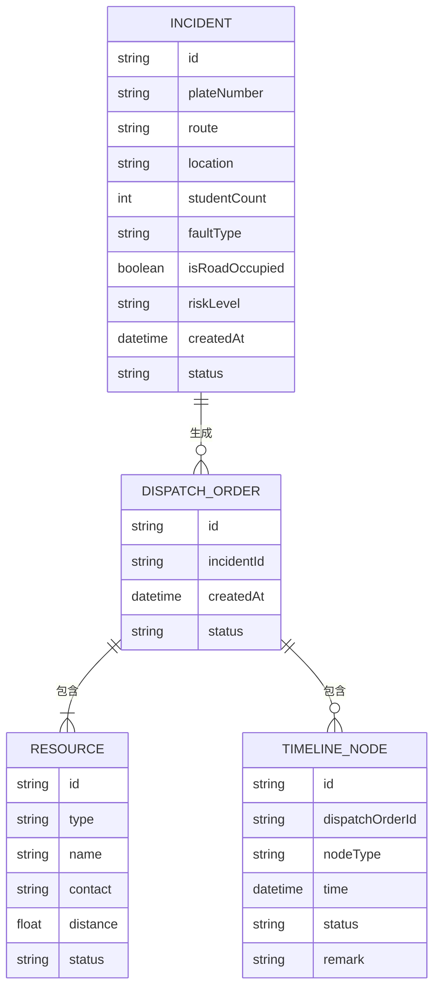

## 1. 架构设计

```mermaid
flowchart TB
    subgraph "前端 (React + TypeScript)
        A["故障接报页
        B["资源匹配页
        C["处置跟踪页
    end
    subgraph "状态管理 (Zustand)"
        D["故障信息 Store"]
        E["资源数据 Store"]
        F["调度单 Store"]
    end
    subgraph "数据层 (Mock Data)"
        G["故障模拟数据"]
        H["资源模拟数据"]
        I["调度记录模拟数据"]
    end
```

## 2. 技术说明

- **前端框架**：React 18 + TypeScript
- **构建工具**：Vite
- **样式方案**：Tailwind CSS 3
- **状态管理**：Zustand
- **路由管理**：React Router DOM
- **图标库**：Lucide React
- **后端**：无后端，纯前端 Mock 数据演示

## 3. 路由定义

| 路由 | 页面 | 说明 |
|------|------|------|
| /incident | 故障接报页 | 录入故障信息，实时风险评估 |
| /resources | 资源匹配页 | 查看附近资源，选择方案生成调度单 |
| /tracking | 处置跟踪页 | 时间轴跟踪救援进度 |

## 4. 数据模型

### 4.1 数据模型定义



### 4.2 类型定义

```typescript
// 故障信息
interface Incident {
  id: string;
  plateNumber: string;
  route: string;
  location: string;
  studentCount: number;
  faultType: string;
  isRoadOccupied: boolean;
  riskLevel: 'red' | 'yellow' | 'green';
  createdAt: Date;
  status: 'pending' | 'processing' | 'completed';
}

// 资源类型
type ResourceType = 'bus' | 'supervisor' | 'repair' | 'tow';

// 资源
interface Resource {
  id: string;
  type: ResourceType;
  name: string;
  contact: string;
  phone: string;
  distance: number;
  status: 'available' | 'busy';
  location?: string;
}

// 调度单
interface DispatchOrder {
  id: string;
  incidentId: string;
  selectedResources: Resource[];
  createdAt: Date;
  status: 'created' | 'dispatched' | 'in_progress' | 'completed';
}

// 时间轴节点
interface TimelineNode {
  id: string;
  type: 'accepted' | 'departed' | 'arrived' | 'transferred' | 'towed';
  title: string;
  time: Date | null;
  status: 'pending' | 'completed' | 'overdue';
  remark?: string;
}
```

## 5. 项目结构

```
src/
├── components/          # 通用组件
│   ├── Layout.tsx       # 布局组件
│   ├── Navbar.tsx      # 导航栏
│   ├── RiskBadge.tsx   # 风险标识组件
│   └── Timeline.tsx     # 时间轴组件
├── pages/               # 页面组件
│   ├── IncidentReport.tsx   # 故障接报页
│   ├── ResourceMatch.tsx  # 资源匹配页
│   └── Tracking.tsx       # 处置跟踪页
├── store/               # 状态管理
│   ├── useIncidentStore.ts
│   ├── useResourceStore.ts
│   └── useDispatchStore.ts
├── data/                # Mock 模拟数据
│   └── mockData.ts
├── utils/               # 工具函数
│   └── riskCalculator.ts
├── types/               # 类型定义
│   └── index.ts
├── App.tsx
├── main.tsx
└── index.css
```

## 6. 核心功能实现思路

### 6.1 风险评估算法

根据三个维度计算综合风险等级：
- **学生滞留风险**：根据学生人数计算
- **道路风险**：根据是否占道、故障类型计算
- **资源距离**：根据最近资源距离计算

三个维度各占一定权重，综合得出红黄绿三级风险。

### 6.2 资源匹配

按距离从近到远排序展示各类资源，支持多选组成完整救援方案。

### 6.3 时间轴跟踪

预设 5 个关键节点，每个节点有预计超时时间，超时自动标红提醒。支持手动确认节点完成。
